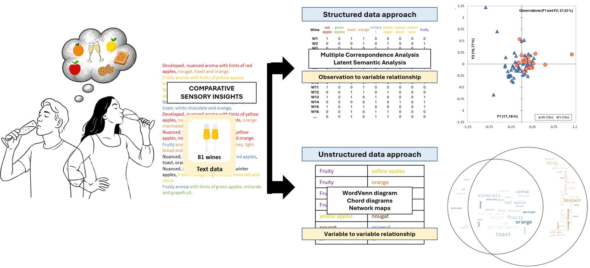

# Suitability of Alternative Approaches to Extracting Wine Sensory Insights from Text Data: Case study in Champagne wines.

Gonzalo Garrido-Bañuelos 1,2*, Mpho Mafata 3, and Astrid Buica 2 4

1. In novate Solutions, Galway, H91 TCX3, Ireland. 
2. School for Data Science and Computational Thinking, Stellenbosch University, Stellenbosch, 
South Africa.
3. Centre for Research on Evaluation, Science and Technology (CREST), Stellenbosch
University, Stellenbosch, Western Cape, South Africa
* Correspondence: gonzalol@innovatesolutions.ie

## Abstract
In wine sensory evaluation, the integration of advanced data analysis techniques with 
more traditional approaches is essential for addressing challenges and improving 
practical applications. 
The current work explores some innovative text mining approaches for obtaining 
sensory information from various sources. 
One aspect of interest is creating specialised dictionaries and lexicons 
through automated processing 
(e.g., Natural Language Processing/NLP), so raw text data can be converted 
into standardised sensory terms understood by specialists. 
Programmatic processing, in this context, refers to the automated extraction, 
transformation, consolidation, and analysis of sensory data, significantly 
reducing human error and allowing for the efficient handling of large 
data volumes which is something not possible through only manual processing. 
The approach is illustrated using diverse data sources, such as structured 
database-type (for example from wine sellers) and open-source data from 
sensory and consumer research publications. 
The manuscript introduces new ways to draw insights using coupled pipelines 
for dimension reduction (Multiple Correspondence Analysis/MCA, 
Correspondence Analysis/CA, Principal Component Analysis/PCA), 
cluster analysis (Latent Semantic Analysis/LSA, Nearest Neighbour/NN), 
and visual tools (network analysis, chord diagrams, word cloud Venn diagrams). 
This manuscript aims to provide practical tools and new insights for sensory specialists 
looking to enhance their evaluation techniques using text data, showcasing the versatility of 
advanced analysis techniques in extracting relevant sensory information. 
These tools use open-source language such as Python and R and can be further 
applied for different product spaces.

## Conclusions
This study compared established, recently reported, and new analytical approaches for extracting sensory insights from wine text data, using aroma descriptions of 81 Champagne wines as a case study. The comparison demonstrated that structured approaches (MCA, AHC, LSA) and unstructured approaches (WordVenn diagrams, chord diagrams, network maps) are not interchangeable but complementary alternatives: the former captures the structure of the sensory space, while the latter resolves the texture of attribute relationships within the space.
Some key outcomes emerge from this work. First, no single method answered all analytical questions; combining approaches produced a more complete characterisation of the Champagne aroma space than any individual tool, including the identification of core category descriptors, sub-style differentiation, and latent sensory dimensions. Second, co-occurrence-based tools (chord diagrams, network maps) proved particularly suited to revealing how shared attributes function differently across product categories, as demonstrated through the differential behaviour of the term “fruity” in vintage and non-vintage wines. Finally, the term-to-term association types identified here (distinguishing core identity associations, sub-style markers, and latent dimensions) offered a reusable framework applicable beyond this specific product space.
These findings provide preliminary practical guidance for sensory experts and wine scientists when selecting analytical approaches for text-based sensory data: the choice of method should be driven by the nature of the question being asked rather than by convention or tool availability. The open-source implementation of all unstructured approaches supports accessibility and reproducibility across research groups and product categories.

__Keywords__: Sensory Science, text data, Natural Language Processing, network maps, 
Latent Semantic Analysis.

